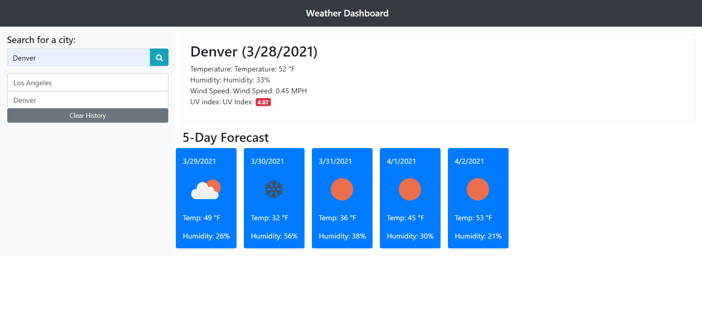

# 06 Server API's Weather Dashboard

## Contributers
* Chris Whalen, Github: **[CobaltFrostfish](https://github.com/CobaltFrostfish)**

## Links
* **[Repository](https://github.com/CobaltFrostfish/weather-dashboard)**
* **[Live site](https://cobaltfrostfish.github.io/weather-dashboard/)**

## The project
Oh the weather outside is weather! This project displays a search window that upon entering a city name and clicking search or pressing enter will show the the current weather for that city as well as a 5 day forcast. If youre trying to plan your week or maybe going on vacation, use the weather dashboard to get a clear heads up of what to expect.

## Technologies applied
* HTML
* CSS
* JavaScript
* Bootstrap
* MomentJS
* Jquery

## The final production:
